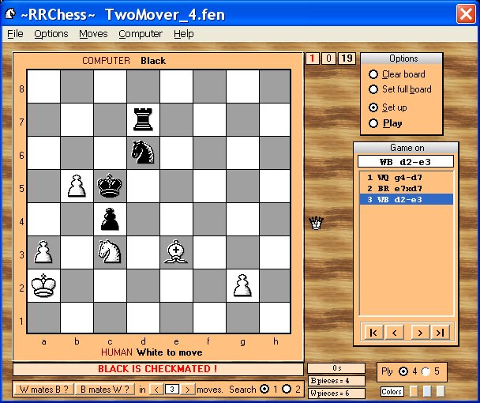



## RRChess\(Updated\)

### Description

~RRChess~ by Robert Rayment. Program to solve checkmate problems and play chess games with another person or against the computer. The chess engine is not very strong, only operating at 4 or 5-ply, so you should be able to win fairly easily but it might surprise you at times. Making such a program bug-free I found quite difficult. So far as I can tell, all the legal moves, castling rules, en passant, promotion etc are OK. There are WAV sounds in the resource file for CHECK, CHECKMATE etc. Games and positions can be saved and loaded. See Help for more info. in particular the section on Starting a game. (Zip 500 KB).

----

Update: to allow computer to play on, if is it's turn, when move list is double-clicked. Code cleaned up a bit from CodeFixer.

----

Update2: added a couple of extra color schemes. These can be changed in Sub cmdColorSchemes.

----

Update3: fixed bug on sound skipping.

----

Update4: correction to playback when computer given odds - so many subtleties!

----

Update5: some typos and menu re-arrangement.
 
### More Info
 
Can input FEN &amp; CHG files

Read Help

             |
---                |---
**Submitted On**   |2005-12-25 10:59:14
**By**             |[Robert Rayment](https://github.com/Planet-Source-Code/PSCIndex/blob/master/ByAuthor/robert-rayment.md)
**Level**          |Intermediate
**User Rating**    |4.9 (176 globes from 36 users)
**Compatibility**  |VB 6\.0
**Category**       |[Games](https://github.com/Planet-Source-Code/PSCIndex/blob/master/ByCategory/games__1-38.md)
**World**          |[Visual Basic](https://github.com/Planet-Source-Code/PSCIndex/blob/master/ByWorld/visual-basic.md)
**Archive File**   |[RRChess\(Up19596812252005\.zip](https://github.com/Planet-Source-Code/robert-rayment-rrchess-updated__1-63241/archive/master.zip)

### API Declarations

A few, see code

